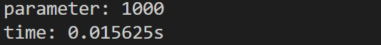
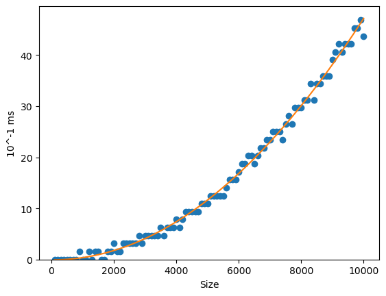
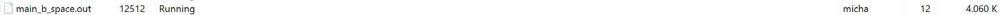
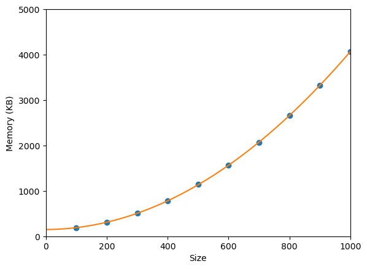

# matrix-vector-mult-benchmark
## Running the code
Before running the code you will need to compile using the command below
```
gcc -o main_test.out main_test.c mylib.o func.time.o
gcc -o main_b_space.out main_b_space.c mylib.o func.time.o
gcc -o main_b_time.out main_b_time.c mylib.o func.time.o
```
or if you are using wsl you can simply type `make` in the terminal.\
\
Once you create a .out file you can run the file by typing in
```
./{filename}.out

```
you can replace the `filename` with `main_test`, `main_b_space`, or `main_b_time` to run the file respectively.
## Time
The time it took to run the process of single matrix vector multiplication doesn't increase until when the value or parameter around 1000 which the time start to increase by very small amount\
\


for the time complexity, I gathered the data from my code and  you will see a linear progression on the graph\
NOTE: The time the graph represent should be in 10<sup>-1</sup> ms, not 100 ms\

## Space
You can see the memory that the code uses by running `main_b_space.out` and the program will keep running until you terminate the program. While running the program you can see the memory it takes by looking in the task manager, below is the sample for the memory with the `SIZE` of 1000


I gather the data for the memory with the `SIZE` ranging from 100 up to 1000 with 100 step between each sample. The data looks like the following:

You can see the graph grows exponentially